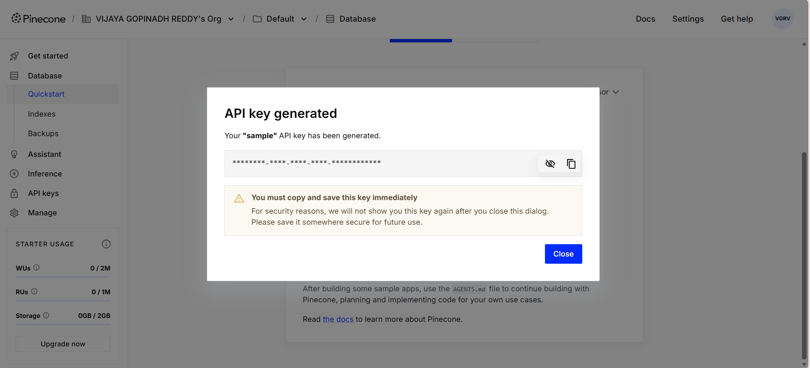

# 📘 Week 1 — Day 6 Journal  

**Date:** 27/12/2025

----
## 🏗️ Phase 1: Project 1 Implementation (Bronze Layer)

### Raw Data Ingestion to Bronze Table
Implemented a reusable ingestion function to load raw CSV data into a Bronze Delta table.

Read source CSV files with headers enabled and schema inference disabled.  
Standardized column names by converting them to lowercase and replacing spaces with underscores.

Added ingestion metadata columns:
- `_hash_md5`: MD5 hash generated from all source columns to uniquely identify records.
- `_ingest_timestamp`: Timestamp capturing the ingestion time.
- `_ingest_author`: User who performed the ingestion.
- `_source_file`: Path of the source file from which the data was ingested.

Wrote the transformed dataset to a Delta table using overwrite mode with schema merge enabled.  
Persisted the data as a managed Delta table under the Bronze layer namespace.

Validated the ingestion by reading from the Bronze table and displaying the results.

----
## 🛠️ Phase 2: DSA Workshop (Stacks)

### 2.3. Valid Parentheses (LeetCode #20)
Implemented a stack-based solution to validate balanced parentheses in a string.

Traversed the input string character by character.  
Pushed opening brackets onto a stack and matched closing brackets against the top of the stack.  
Popped elements from the stack when a valid matching pair was found.  
Verified validity by ensuring the stack was empty after processing the entire string.

### 2.4. Min Stack (LeetCode #155)
Implemented a stack data structure supporting constant-time retrieval of the minimum element.

Used two stacks:
- One stack to store the actual values.
- A secondary stack to track the minimum value at each level.

Updated the minimum-tracking stack during push and pop operations to keep the current minimum in sync with the main stack.

### 2.5. Evaluate Reverse Polish Notation (LeetCode #150)
Implemented a stack-based evaluator for arithmetic expressions in Reverse Polish Notation.

Iterated through the list of tokens:
- Pushed numeric operands onto the stack.
- Applied arithmetic operations by popping operands from the stack when an operator was encountered.
- Pushed the computed result back onto the stack.

Returned the final value remaining on the stack after processing all tokens.

---
## 🤖 Phase 3: GenAI Infrastructure Prep

Created an account on Pinecone and generated an API key to enable future vector database integration and GenAI use cases.

----
## Verification Question

**Question:**  
*If I process a CSV file today with 5 columns, and tomorrow I receive a CSV with 6 columns, what happens to my Bronze Delta Table if `mergeSchema` is set to `false`?*

**Answer:**  
- The write operation fails because the incoming data schema does not match the existing table schema.
- When `mergeSchema` is enabled, Delta Lake merges the new columns into the existing table schema and updates it accordingly.
- Delta Lake also provides the `overwriteSchema` option, which replaces the existing table schema entirely with the new schema during an overwrite operation.

----

# ✔️ Day 6 Status: _CLEARED_
