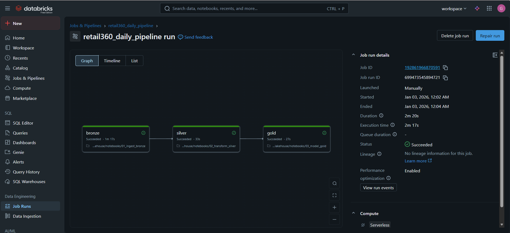

# 📘 Week 2 — Day 8 Journal  

**Date:** 02/01/2026

----
## 🛠️ Phase 1: Algorithmic Engineering (DSA)

### 1. Binary Search (LeetCode #704)
Implemented a binary search algorithm to locate a target value in a sorted array.

Initialized left and right pointers to define the search boundaries.  
Repeatedly calculated the middle index and compared the middle element with the target.  
Narrowed the search space by adjusting pointers based on comparison results.  
Returned the index of the target when found, or `-1` when the target was not present.

### 2. Search a 2D Matrix (LeetCode #74)
Implemented a binary search approach on a 2D matrix by treating it as a virtual 1D sorted array.

Calculated the effective search range using the total number of elements in the matrix.  
Mapped the computed mid index to 2D coordinates using row and column calculations.  
Applied binary search logic to locate the target value within the matrix.  
Returned a boolean result indicating whether the target exists in the matrix.

----
## 🏗️ Phase 2: Engineering Orchestration

Created a Databricks Job named `retail360_daily_pipeline` to automate the execution of the Lakehouse pipeline using a task-based workflow.

Configured the job with three dependent tasks:
- **Bronze Task:** Executes the `01_ingest_bronze` notebook to ingest raw data.
- **Silver Task:** Executes the `02_transform_silver` notebook and is configured to run after the Bronze task.
- **Gold Task:** Executes the `03_model_gold` notebook and is configured to run after the Silver task.

Defined task dependencies to enforce the execution order: Bronze → Silver → Gold.

Executed the job manually using the “Run Now” option and observed a successful run:
- All three tasks completed successfully.
- Each task ran sequentially based on the configured dependencies.
- The workflow execution completed without errors.

Verified the pipeline execution using the job run graph view, confirming correct orchestration of the end-to-end Lakehouse process.

----
## 📐 Phase 3: System Design

Reviewed differences between DAG-based orchestrators and traditional CRON scheduling.

- DAG-based orchestrators provide a graphical interface to define, visualize, and manage workflow dependencies.
- CRON jobs are suitable for simple, independent tasks but do not natively support complex dependencies or multi-step workflows.
- In DAG-based systems, if a task fails, only the failed task (or its downstream dependencies) can be re-run without re-executing the entire workflow.
- With CRON-based workflows, failures typically require re-running the full job or manual intervention, increasing operational complexity and risk of errors.

----
## Verification Question

**Question:**  
*In a Binary Search on a sorted array of size 1,000,000, what is the **maximum** number of comparisons needed to find an element? (Approximate is fine).*

**Answer:**  
- Binary search reduces the search space by half on each comparison.
- For an array of size 1,000,000, the maximum number of comparisons required is approximately `log₂(1,000,000)`.
- This evaluates to about **20 comparisons** in the worst case.

----

# ✔️ Day 8 Status: _CLEARED_
