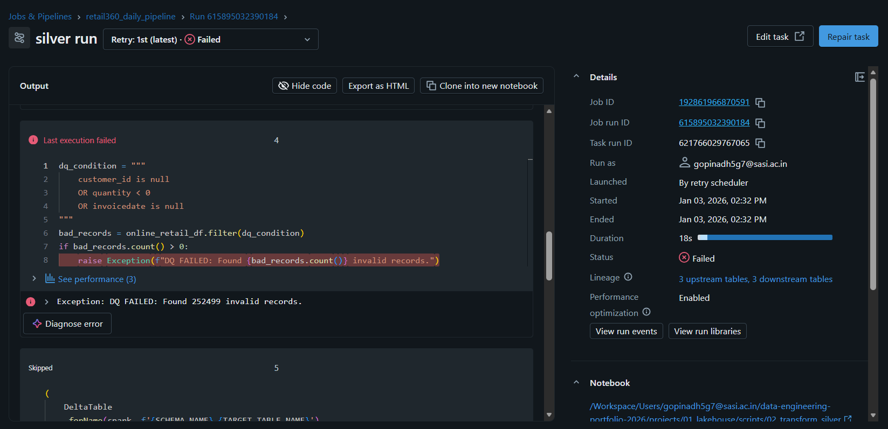

# 📘 Week 2 — Day 9 Journal  

**Date:** 03/01/2026

----
## 🛠️ Phase 1: Algorithmic Engineering (DSA)

### 1. Maximum Depth of Binary Tree (LeetCode #104)
Implemented a recursive Depth-First Search (DFS) solution to compute the maximum depth of a binary tree.

Traversed the tree recursively by visiting left and right subtrees.  
Calculated depth at each node as `1 + max(left_depth, right_depth)`.  
Returned `0` for null nodes to correctly handle leaf termination.

### 2. Invert Binary Tree (LeetCode #226)
Implemented a recursive solution to invert a binary tree.

Traversed the tree using DFS and swapped the left and right child pointers at each node.  
Applied the same logic recursively to all subtrees until the entire tree was inverted.

### 3. Same Tree (LeetCode #100)
Implemented a tree comparison algorithm to check whether two binary trees are identical.

Traversed both trees simultaneously and compared node values and structure.  
Verified equality by ensuring:
- Both nodes exist or are null at the same position.
- Node values match.
- Left and right subtrees match recursively.

----
## 🏗️ Phase 2: Engineering Data Quality

### 4. Implement Data Quality Gates
Integrated data quality validation logic into the Silver layer transformation and executed the pipeline using Databricks Workflows.

Configured the `retail360_daily_pipeline` job with dependent tasks for Bronze, Silver, and Gold layers.  
Triggered the pipeline execution and observed successful completion of the Bronze task.

During the Silver task execution, applied data quality checks to identify invalid records based on the following conditions:
- `customer_id` is null
- `quantity < 0`
- `invoicedate` is null

Filtered records matching the data quality conditions and evaluated their count prior to executing the MERGE operation.  
Configured the Silver transformation to raise an exception when invalid records are detected.

Observed that the Silver task failed with a data quality exception indicating the presence of invalid records.  
The job execution stopped at the Silver stage, and downstream Gold task execution was skipped.

Verified that the failure was correctly surfaced in the Databricks job run details, confirming that the data quality gate successfully prevented invalid data from propagating into downstream layers.

----
## 📐 Phase 3: System Design

### 5. The WAP Pattern (Write-Audit-Publish)

----
## Verification Question

**Question:**  
*If I have a binary tree with $N$ nodes, what is the Time Complexity of visiting every node exactly once?*

**Answer:**  

----

# ✔️ Day 9 Status: _IN-PROGRESS_
